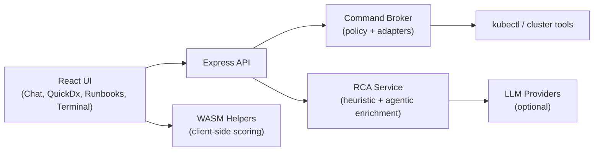

# KubeAgentiX CE

<div align="center">
  
</div>

<div align="center">

[](https://github.com/kubeagentix/kubeagentix-ce/actions/workflows/ci.yml)
[](https://github.com/kubeagentix/kubeagentix-ce/actions/workflows/security.yml)
[](https://github.com/kubeagentix/kubeagentix-ce/actions/workflows/codeql.yml)
[](https://github.com/kubeagentix/kubeagentix-ce/actions/workflows/docs-pages.yml)
[](https://github.com/kubeagentix/kubeagentix-ce/stargazers)
[](./LICENSE)

</div>

KubeAgentiX CE is an open-source Kubernetes diagnostics copilot focused on one core workflow:

**Guided RCA -> Safe Action Plan -> Skill-driven execution**

It helps operators and developers diagnose Kubernetes incidents faster using explainable evidence from cluster data (events, logs, status, metrics) while preserving execution safety with policy-guarded command routing.

## Key Features

- Guided Quick Diagnosis (QuickDx) with confidence breakdown and evidence traces.
- AI-assisted Chat with deterministic fallback behavior.
- Terminal with dual modes:
  - Command mode (direct kubectl execution)
  - Natural Language mode (NL -> safe command suggestion -> edit -> execute)
- Skill-driven Runbooks for structured remediation workflows.
- Broker policy layer (allowlist, guardrails, typed errors, auditability).
- Browser-first architecture with optional WASM-assisted analysis helpers.

## Why CLI Tools for Agentic Ops (vs MCP-heavy/custom stacks)

KubeAgentiX CE is deliberately built around **real CLI tools for agents** (starting with `kubectl`) instead of requiring every capability to be re-implemented as MCP/custom tools.

- Reuses existing kubeconfig, contexts, and plugin workflows operators already trust.
- Lowers integration overhead and maintenance burden for DevOps-heavy environments.
- Makes command preview + policy gating explicit before execution.
- Keeps behavior observable with concrete commands and outputs.

MCP/custom tools are still useful where needed, but CLI-first gives a faster and more pragmatic path for Kubernetes operations.

## Architecture



## Quickstart

### Prerequisites

- Node.js 22+
- pnpm 10+
- kubectl configured for a reachable cluster context

### Option A: Local Run

```bash
git clone https://github.com/kubeagentix/kubeagentix-ce.git
cd kubeagentix-ce
pnpm install
cp .env.example .env
pnpm dev
```

### Option B: Docker Compose Run

```bash
git clone https://github.com/kubeagentix/kubeagentix-ce.git
cd kubeagentix-ce
cp .env.example .env
docker compose up --build
```

This launches KubeAgentiX CE at `http://localhost:4000` and mounts your local kubeconfig as read-only.

### Build and Test

```bash
pnpm typecheck
pnpm test
pnpm build
pnpm e2e
pnpm --dir docs-site build
```

## Environment Variables

See `.env.example` for full set. Typical variables:

- `PORT` (default `4000`)
- `ANTHROPIC_API_KEY`
- `OPENAI_API_KEY`
- `GOOGLE_API_KEY`
- `VITE_USE_WASM_CORE`

If no LLM keys are set, heuristic fallback paths remain available for core diagnosis/suggestion flows.

## Documentation

- User docs: `docs-site/docs/users/`
- Developer docs: `docs-site/docs/developers/`
- Docusaurus site: `docs-site/`

To run docs locally:

```bash
pnpm --dir docs-site install
pnpm --dir docs-site start
```

## Security

- Security policy: [SECURITY.md](./SECURITY.md)
- CI security checks include dependency review, vulnerability scan, secret scan, CodeQL, and SBOM generation.

## Contributing

Contributions are welcome.

- Read [CONTRIBUTING.md](./CONTRIBUTING.md)
- Follow [CODE_OF_CONDUCT.md](./CODE_OF_CONDUCT.md)
- Open issues for bugs, UX gaps, and feature proposals

## Roadmap (Public)

Near-term OSS focus:

- Improve RCA precision and explainability.
- Expand skills coverage and verification flows.
- Strengthen multi-cluster context handling.
- Improve observability integrations in a non-breaking way.
- Add an optional NPX bootstrap flow for one-command local startup.

## Community

- GitHub: https://github.com/kubeagentix/kubeagentix-ce
- Discussions and issues are the primary feedback channel.
- Agentic DevOps Collective: https://agenticdevops.org/

If this project helps you, please star the repo: https://github.com/kubeagentix/kubeagentix-ce

### Star History

[](https://star-history.com/#kubeagentix/kubeagentix-ce&Date)

## License

Apache License 2.0. See [LICENSE](./LICENSE).
