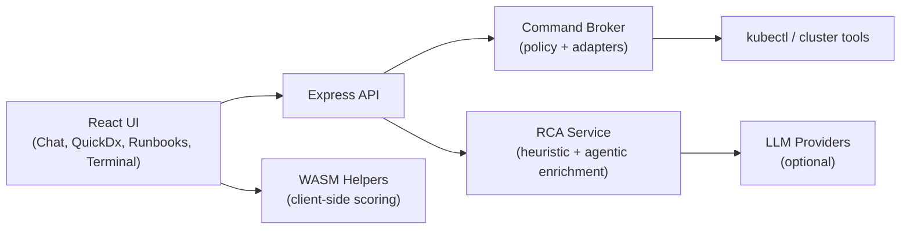

# KubeAgentiX CE

<div align="center">
  
</div>

<div align="center">

[](https://github.com/kubeagentix/kubeagentix-ce/actions/workflows/ci.yml)
[](https://github.com/kubeagentix/kubeagentix-ce/actions/workflows/security.yml)
[](https://github.com/kubeagentix/kubeagentix-ce/actions/workflows/codeql.yml)
[](https://github.com/kubeagentix/kubeagentix-ce/actions/workflows/docs-pages.yml)
[](https://github.com/kubeagentix/kubeagentix-ce/stargazers)
[](./LICENSE)

</div>

KubeAgentiX CE is an open-source Kubernetes diagnostics copilot focused on one core workflow:

**Guided RCA -> Safe Action Plan -> Skill-driven execution**

It helps operators and developers diagnose Kubernetes incidents faster using explainable evidence from cluster data (events, logs, status, metrics) while preserving execution safety with policy-guarded command routing.

## UI Gallery

<div align="center">
  
  
</div>
<div align="center">
  
  
</div>

## 1-Minute Setup

```bash
npx kubeagentix-ce@latest
```

KubeAgentiX CE starts on `http://localhost:4000` by default.

If this project helps you, please star the repo: https://github.com/kubeagentix/kubeagentix-ce

## Key Features

- Guided Quick Diagnosis (QuickDx) with confidence breakdown and evidence traces.
- AI-assisted Chat with deterministic fallback behavior.
- Terminal with dual modes:
  - Command mode (direct kubectl execution)
  - Natural Language mode (NL -> safe command suggestion -> edit -> execute)
- Skill-driven Runbooks for structured remediation workflows.
- Broker policy layer (allowlist, guardrails, typed errors, auditability).
- Browser-first architecture with optional WASM-assisted analysis helpers.

## Why CLI Tools for Agentic Ops (vs MCP-heavy/custom stacks)

KubeAgentiX CE is deliberately built around **real CLI tools for agents** (starting with `kubectl`) instead of requiring every capability to be re-implemented as MCP/custom tools.

- Reuses existing kubeconfig, contexts, and plugin workflows operators already trust.
- Lowers integration overhead and maintenance burden for DevOps-heavy environments.
- Makes command preview + policy gating explicit before execution.
- Keeps behavior observable with concrete commands and outputs.

MCP/custom tools are still useful where needed, but CLI-first gives a faster and more pragmatic path for Kubernetes operations.

## Architecture



## Quickstart

### Prerequisites

- Node.js 22+
- pnpm 10+
- kubectl installed and available on `PATH`
- kubeconfig/context configured (`~/.kube/config` or `KUBECONFIG`)

### Option A: Docker Compose (Secondary)

```bash
git clone https://github.com/kubeagentix/kubeagentix-ce.git
cd kubeagentix-ce
cp .env.example .env
docker compose up --build
```

Docker mode mounts your host kubeconfig from `${HOME}/.kube` and runs `kubectl`
inside the container. For local clusters that expose the API server on
`127.0.0.1`/`localhost` (for example kind), the container starts localhost TCP
bridges to the host by default so kubeconfig can keep using local endpoints.
It also mounts `${HOME}/.claude` and includes Claude Code CLI so the
`Claude Code (Subscription)` provider can run without Anthropic API keys.

### Optional Bootstrap CLI (Secondary)

If you prefer scaffolding into a local folder first:

```bash
npx create-kubeagentix-ce@latest
```

### Option B: Local From Source

```bash
git clone https://github.com/kubeagentix/kubeagentix-ce.git
cd kubeagentix-ce
pnpm install
cp .env.example .env
pnpm dev
```

### Build and Test

```bash
pnpm typecheck
pnpm test
pnpm build
pnpm e2e
pnpm --dir docs-site build
```

## Environment Variables

See `.env.example` for full set. Typical variables:

- `PORT` (default `4000`)
- `ANTHROPIC_API_KEY`
- `ANTHROPIC_AUTH_TOKEN` (legacy auth token alias; OAuth users should prefer `CLAUDE_CODE_OAUTH_TOKEN`)
- `OPENAI_API_KEY`
- `GOOGLE_API_KEY`
- `VITE_USE_WASM_CORE`
- `ENABLE_CLAUDE_SDK_BRIDGE` (default `false`, enables websocket bridge for local Claude Code CLI)
- `CLAUDE_SDK_CLI_PATH` (default `claude`)
- `CLAUDE_SDK_LOCAL_HOST` (default `127.0.0.1`)
- `ENABLE_CLAUDE_CODE_PROVIDER` (default `true`, auto-enables local Claude Code provider when CLI is available)
- `CLAUDE_CODE_CLI_PATH` (default `claude`)
- `CLAUDE_CODE_TIMEOUT_MS` (default `45000`)
- `CLAUDE_CODE_OAUTH_TOKEN` (optional subscription/OAuth token for Claude Code provider, headless)
- `CLAUDE_CODE_AUTH_TOKEN` (legacy alias, still accepted)
- `CLAUDE_CODE_SETTING_SOURCES` (default `project,local` to avoid user hook side-effects in non-interactive mode)

If no LLM keys are set, heuristic fallback paths remain available for core diagnosis/suggestion flows.

## Troubleshooting

- No kubectl found:
  For local mode, install kubectl and ensure it is on `PATH`.
  For Docker mode, rebuild the image: `docker compose up --build`.
- No kubeconfig found:
  Configure cluster access in `~/.kube/config` or set `KUBECONFIG`.
- Docker + localhost cluster endpoint:
  If your kubeconfig uses `localhost`/`127.0.0.1`, keep
  `KUBEAGENTIX_PROXY_LOCALHOST_KUBECONFIG=true` (default) so the container can
  bridge localhost ports to the host endpoint.
- Docker + kind cluster on Linux:
  kind binds the API server to `127.0.0.1` by default. Inside Docker,
  `host.docker.internal` resolves to the Docker bridge gateway (`172.17.0.1`),
  not the host loopback — so the localhost bridge above won't reach it.
  Fix: recreate the cluster with `apiServerAddress` set to the Docker bridge IP:
  ```bash
  kind delete cluster
  kind create cluster --config - <<'EOF'
  kind: Cluster
  apiVersion: kind.x-k8s.io/v1alpha4
  networking:
    apiServerAddress: "172.17.0.1"
  EOF
  ```
  This makes the API server reachable from both the host and inside any Docker container.
- Claude SDK bridge disabled:
  Set `ENABLE_CLAUDE_SDK_BRIDGE=true`, then use:
  `POST /api/claude-sdk/sessions` and connect browser websocket to
  `/ws/browser/:sessionId`.
- Claude Code provider unavailable:
  Install Claude Code CLI and keep `ENABLE_CLAUDE_CODE_PROVIDER=true`.
  For local usage run `claude /login`.
  For Docker/headless usage provide `CLAUDE_CODE_OAUTH_TOKEN` (subscription token)
  or `ANTHROPIC_API_KEY`.
  You can also keep container env empty and paste token in Settings > Claude Code provider;
  the app now forwards this token per request (without requiring env injection).
  If auth still fails in Docker, set `CLAUDE_CODE_OAUTH_TOKEN` explicitly and recreate containers.
  You can also paste a Claude auth token in Settings > Claude Code provider (optional token field).
- Port already in use:
  Run with a different port:
  `PORT=4100 npx kubeagentix-ce@latest`

## Documentation

- User docs: `docs-site/docs/users/`
- Developer docs: `docs-site/docs/developers/`
- Docusaurus site: `docs-site/`

To run docs locally:

```bash
pnpm --dir docs-site install
pnpm --dir docs-site start
```

## Security

- Security policy: [SECURITY.md](./SECURITY.md)
- CI security checks include dependency review, vulnerability scan, secret scan, CodeQL, and SBOM generation.

## Contributing

Contributions are welcome.

- Read [CONTRIBUTING.md](./CONTRIBUTING.md)
- Follow [CODE_OF_CONDUCT.md](./CODE_OF_CONDUCT.md)
- Open issues for bugs, UX gaps, and feature proposals

## Roadmap (Public)

Near-term OSS focus:

- Improve RCA precision and explainability.
- Expand skills coverage and verification flows.
- Strengthen multi-cluster context handling.
- Improve observability integrations in a non-breaking way.
- Add an optional NPX bootstrap flow for one-command local startup.

## Community

- GitHub: https://github.com/kubeagentix/kubeagentix-ce
- Discussions and issues are the primary feedback channel.
- Agentic DevOps Collective: https://agenticdevops.org/

If this project helps you, please star the repo: https://github.com/kubeagentix/kubeagentix-ce

### Star History

[](https://star-history.com/#kubeagentix/kubeagentix-ce&Date)

## License

Apache License 2.0. See [LICENSE](./LICENSE).
